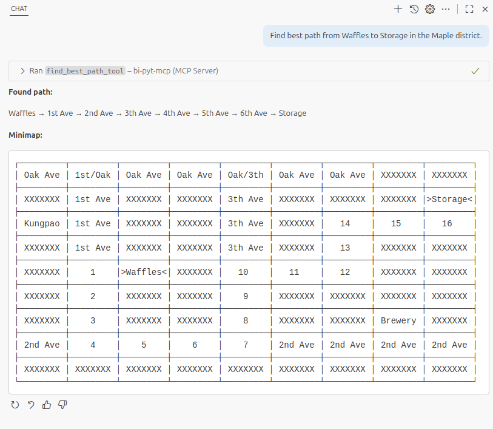

# Homework 1: MCP Server - Path Finder

## Introduction
The goal of this assignment is to create a server using the Model Context Protocol (MCP) introduced by Anthropic in November 2024. MCP is a protocol that allows Large Language Models (LLMs) to leverage powerful **tools**, rather than functioning solely as text-to-text models. These tools enable the LLM to perform actions such as web searches, file edits, query executions, weather lookups, and more.

Additionally, MCP defines **prompt templates** that guide users in creating effective prompts. In contrast, **resources** enable MCP Servers to expose a file to the user, which is then used as input to the LLM along with a prompt.


Implement your solution only inside the `mcp_server.py` file.

For further guidance consult:
- The Python Model Context Protocol library on [GitHub](https://github.com/modelcontextprotocol/python-sdk)
- The official Model Context Protocol documentation: [prompt templates](https://modelcontextprotocol.io/specification/2025-06-18/server/prompts), [resources](https://modelcontextprotocol.io/specification/2025-06-18/server/resources), [tools](https://modelcontextprotocol.io/specification/2025-06-18/server/tools)

### Required packages
- `fastmcp`
- `pytest-asyncio` *(for running public tests)*

Tested with `python==3.12` and module `fastmcp==2.12.3`.

# Goal
The goal of this project is to create a *Path Finder* MCP Server which helps navigate users from where they are to their desired building. Secondly we will also expose a prompt template and a resource.

**Prompt:** Find the path from *Waffles* to *Storage* in the *Maple* district.

**Output** (of the `find_best_path_tool` tool):
```
Found path:
    Waffles → 1st Ave → 2nd Ave → 3rd Ave → 4th Ave → 5th Ave → 6th Ave → Storage
Minimap:
    ┌─────────┬─────────┬─────────┬─────────┬─────────┬─────────┬─────────┬─────────┬─────────┐
    │ Oak Ave │ 1st/Oak │ Oak Ave │ Oak Ave │ Oak/3rd │ Oak Ave │ Oak Ave │ XXXXXXX │ XXXXXXX │
    ├─────────┼─────────┼─────────┼─────────┼─────────┼─────────┼─────────┼─────────┼─────────┤
    │ XXXXXXX │ 1st Ave │ XXXXXXX │ XXXXXXX │ 3rd Ave │ XXXXXXX │ XXXXXXX │ XXXXXXX │>Storage<│
    ├─────────┼─────────┼─────────┼─────────┼─────────┼─────────┼─────────┼─────────┼─────────┤
    │ Kungpao │ 1st Ave │ XXXXXXX │ XXXXXXX │ 3rd Ave │ XXXXXXX │   14    │   15    │   16    │
    ├─────────┼─────────┼─────────┼─────────┼─────────┼─────────┼─────────┼─────────┼─────────┤
    │ XXXXXXX │ 1st Ave │ XXXXXXX │ XXXXXXX │ 3rd Ave │ XXXXXXX │   13    │ XXXXXXX │ XXXXXXX │
    ├─────────┼─────────┼─────────┼─────────┼─────────┼─────────┼─────────┼─────────┼─────────┤
    │ XXXXXXX │    1    │>Waffles<│ XXXXXXX │   10    │   11    │   12    │ XXXXXXX │ XXXXXXX │
    ├─────────┼─────────┼─────────┼─────────┼─────────┼─────────┼─────────┼─────────┼─────────┤
    │ XXXXXXX │    2    │ XXXXXXX │ XXXXXXX │    9    │ XXXXXXX │ XXXXXXX │ XXXXXXX │ XXXXXXX │
    ├─────────┼─────────┼─────────┼─────────┼─────────┼─────────┼─────────┼─────────┼─────────┤
    │ XXXXXXX │    3    │ XXXXXXX │ XXXXXXX │    8    │ XXXXXXX │ XXXXXXX │ Brewery │ XXXXXXX │
    ├─────────┼─────────┼─────────┼─────────┼─────────┼─────────┼─────────┼─────────┼─────────┤
    │ 2nd Ave │    4    │    5    │    6    │    7    │ 2nd Ave │ 2nd Ave │ 2nd Ave │ 2nd Ave │
    ├─────────┼─────────┼─────────┼─────────┼─────────┼─────────┼─────────┼─────────┼─────────┤
    │ XXXXXXX │ XXXXXXX │ XXXXXXX │ XXXXXXX │ XXXXXXX │ XXXXXXX │ XXXXXXX │ XXXXXXX │ XXXXXXX │
    └─────────┴─────────┴─────────┴─────────┴─────────┴─────────┴─────────┴─────────┴─────────┘
Instructions:
    Copy the 'Found path' and 'Minimap' outputs to the user in Markdown.
```

# General
In your implementation you are free to use constants, classes and methods from `utils.py`. However you can not edit this file.
## General conditions
- Code must follow PEP8
- Correctly implement the MCP interface
- The server host must be `localhost` and the port must be `8000`
- The only allowed imports are `mcp`, `re` and `utils.py` modules (e.g. `import mcp.server.fastmcp.exceptions`)
# Validation
- **District name** can contain only alphanumerical values, spaces, single quotes (`'`) and underscores (`_`).
- **Building name** can only contain alphanumerical values and spaces. It must always be 7 characters long. It must exists within the district.
- **Avenue** can only contain alphanumerical values and is always in the format `"XXX Ave"` or `"XXX/YYY"` if it is an intersection of two avenues.
- When validating, if the input does not conform to conditions, you must raise `FastMCPError`. An exact wording of the error message string is not required, the AI will understand (e.g. `"Building name should have 7 letters."` and `"Seven letters are required for the building name parameter."` are understood equally).
- The indentation of the `find_best_path_tool` tool output  uses 4 spaces
  
# Task 1 - Prompt Template
Implement a prompt template endpoint using a function called `sample_prompt`. The prompt description or docstring must be `"Creates a new prompt to find best path."`. The function must return exactly `"Find best path from Waffles to Storage in the Maple district."` Use the `@server.prompt` decorator to register the tool with the MCP server.

# Task 2 - Resource
Implement a resource endpoint using a function called `district_resource`. The resource description or docstring must be `"Get a desired district resource."`. The function must accept one parameter representing the district name. Use the `@server.resource` decorator to register the resource with the MCP server. Make sure the resource is available under the URI `"district://{district_name}"`. 

The function must validate the input, load the appropriate district file and return its contents.

# Task 3 - Tool
Implement a tool endpoint using a function called `find_best_path_tool`. The tool description or docstring must be `"Find the optimal path between two buildings in a district and return both the path and a minimap showing the path steps."` as this will be read by LLM. It must contain three parameters `building_from`, `building_to`, `district_name` all of which are type string. Use the `@server.tool` decorator to register the tool with the MCP server. 

The function must validate input, find closest path in the district from `building_from` to `building_to` and return the result in an exact string as is the following example. The left-indent is 4 spaces.

```
Found path:
    Waffles → 1st Ave → 2nd Ave → 3rd Ave → 4th Ave → 5th Ave → 6th Ave → Storage
Minimap:
    ┌─────────┬─────────┬─────────┬─────────┬─────────┬─────────┬─────────┬─────────┬─────────┐
    │ Oak Ave │ 1st/Oak │ Oak Ave │ Oak Ave │ Oak/3rd │ Oak Ave │ Oak Ave │ XXXXXXX │ XXXXXXX │
    ├─────────┼─────────┼─────────┼─────────┼─────────┼─────────┼─────────┼─────────┼─────────┤
    │ XXXXXXX │ 1st Ave │ XXXXXXX │ XXXXXXX │ 3rd Ave │ XXXXXXX │ XXXXXXX │ XXXXXXX │>Storage<│
    ├─────────┼─────────┼─────────┼─────────┼─────────┼─────────┼─────────┼─────────┼─────────┤
    │ Kungpao │ 1st Ave │ XXXXXXX │ XXXXXXX │ 3rd Ave │ XXXXXXX │   14    │   15    │   16    │
    ├─────────┼─────────┼─────────┼─────────┼─────────┼─────────┼─────────┼─────────┼─────────┤
    │ XXXXXXX │ 1st Ave │ XXXXXXX │ XXXXXXX │ 3rd Ave │ XXXXXXX │   13    │ XXXXXXX │ XXXXXXX │
    ├─────────┼─────────┼─────────┼─────────┼─────────┼─────────┼─────────┼─────────┼─────────┤
    │ XXXXXXX │    1    │>Waffles<│ XXXXXXX │   10    │   11    │   12    │ XXXXXXX │ XXXXXXX │
    ├─────────┼─────────┼─────────┼─────────┼─────────┼─────────┼─────────┼─────────┼─────────┤
    │ XXXXXXX │    2    │ XXXXXXX │ XXXXXXX │    9    │ XXXXXXX │ XXXXXXX │ XXXXXXX │ XXXXXXX │
    ├─────────┼─────────┼─────────┼─────────┼─────────┼─────────┼─────────┼─────────┼─────────┤
    │ XXXXXXX │    3    │ XXXXXXX │ XXXXXXX │    8    │ XXXXXXX │ XXXXXXX │ Brewery │ XXXXXXX │
    ├─────────┼─────────┼─────────┼─────────┼─────────┼─────────┼─────────┼─────────┼─────────┤
    │ 2nd Ave │    4    │    5    │    6    │    7    │ 2nd Ave │ 2nd Ave │ 2nd Ave │ 2nd Ave │
    ├─────────┼─────────┼─────────┼─────────┼─────────┼─────────┼─────────┼─────────┼─────────┤
    │ XXXXXXX │ XXXXXXX │ XXXXXXX │ XXXXXXX │ XXXXXXX │ XXXXXXX │ XXXXXXX │ XXXXXXX │ XXXXXXX │
    └─────────┴─────────┴─────────┴─────────┴─────────┴─────────┴─────────┴─────────┴─────────┘
Instructions:
    Copy the 'Found path' and 'Minimap' outputs to the user in Markdown.
```

The `Found path` section includes only the avenues whose segments lie on the path and are not intersections.

Note: You have to use the following special characters: `┌`, `┐`, `└`, `┘`, `├`, `┤`, `┬`, `┴` , `┼`, `─`, `│`, `→`. Also make sure that `building_from` and `building_to` are surrounded by `>` and `<`. The 'Instructions' section will force the AI model to output the results to user's chat.


# Testing
There are available public tests in the `test_mcp_server.py` file. They can be run locally using `pytest`. You will need the package `pytest-asyncio` to run the tests.


<hr>


# Optional: GitHub Copilot Chat + MCP server
Here we will go through how to use the endpoints we created within GitHub Copilot Chat. Note: The following instructions utilize LLM within Visual Studio Code which does consume tokens.
## Setup
### 1 Run MCP Server
Run the command `python mcp_server.py`.

### 2. Add MCP server (VSCode)
Create a new file in the location `<repository>/.vscode/mcp.json`. Copy the following configuration into it.
```json
{
    "servers": {
        "bi-pyt-mcp": {
            "url": "http://localhost:8000/mcp",
            "type": "http"
        }
    },
}
```

### 3. Connect to MCP server
 1. Press `CTRL + SHIFT + P` to open *Command Palette*
 2. Select `MCP: List Servers`
 3. Select `bi-pyt-mcp`
 4. Select `Start Server` (to start the MCP Client server)
### 4. Open GitHub Copilot
1. Open GitHub Copilot using `CTR + B` (VS Code **GitHub Copilot Extension** is required). **Make sure that Agent mode is selected in the chat window.**
## Usage
### 1. Trigger prompt templates
To trigger a prompt template, type `/` in the *GitHub Copilot Chat* the available templates will then be listed (e.g. `/mcp.bi-pyt-mcp.sample_prompt`).

### 2. Insert resources
1. In the GitHub Copilot Chat select `Add Context...`
2. Select `MCP Resources`
3. Select resource (e.g. `district_resource`)


### 3. Trigger tools
Type a relevant prompt that will make the LLM understand that we need to call a certain tool.
For the tool `find_best_path_tool` you can say.
```
Find a route from Waffles to Storage within the Maple district.
``` 
To hint the LLM which tool to use, type `#` followed by the tool name (e.g., `find_best_path_tool`) before sending the prompt.

### Demo
